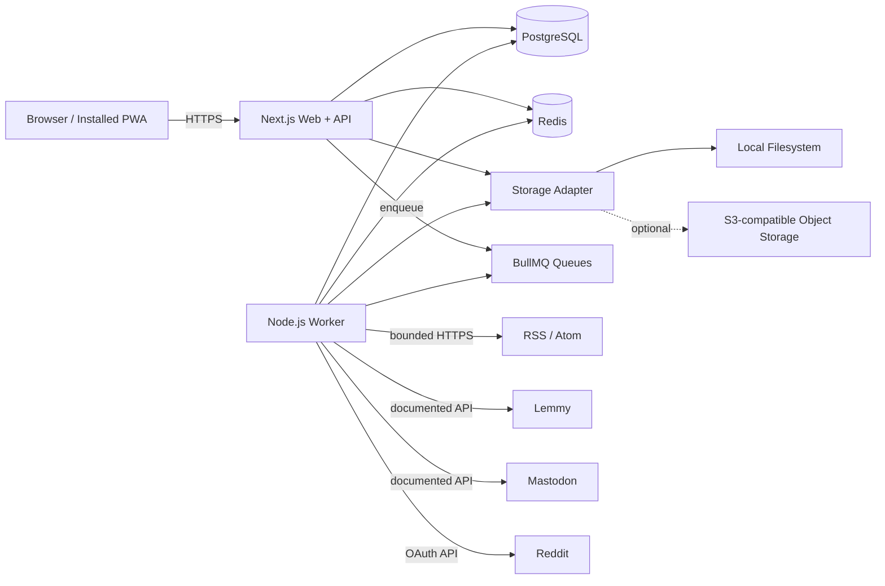
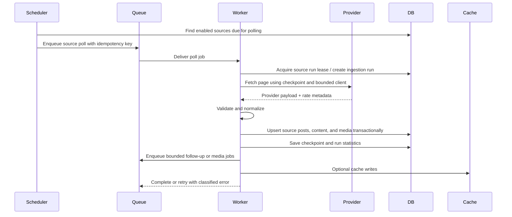

# Architecture

## 1. System context

MirthSpool separates interactive web traffic from background ingestion. Remote providers are untrusted external systems. PostgreSQL is the durable source of truth; Redis is coordination infrastructure and may be rebuilt.

## 2. Deployment units

### `apps/web`

Responsibilities:

- Server-rendered application shell.
- Authentication and authorization.
- Source-management APIs and screens.
- Feed, search, library, and settings APIs.
- PWA assets.
- Signed access to cached media.
- Liveness and readiness endpoints.

The web process must not perform long-running ingestion in the request lifecycle.

### `apps/worker`

Responsibilities:

- Poll scheduling.
- Connector execution.
- Normalization and validation.
- Idempotent persistence.
- Duplicate-analysis jobs.
- Cache-fetch and eviction jobs.
- Maintenance jobs.
- Source-health updates.

The worker may have multiple replicas. Jobs and database constraints must make concurrent execution safe.

### `packages/connectors`

Contains the connector contract, provider clients, normalization code, fixture parsers, rate-limit adapters, and sanitized provider errors.

Connector modules must not import UI code or make direct assumptions about session users.

### `packages/db`

Contains the Prisma schema, generated client boundary, migrations, repositories, and transaction helpers.

### `packages/shared`

Contains domain types, Zod schemas, stable error codes, cursor helpers, clock abstractions, and shared utilities that do not depend on a specific runtime.

### `packages/config`

Validates environment variables once at process startup. No application module should read arbitrary `process.env` values directly.

### `packages/ui`

Contains accessible shared components used by the web application.

## 3. Ingestion flow

Rules:

- The queue job ID should prevent duplicate scheduled jobs for the same source and time window.
- A database uniqueness constraint is the final defense against duplicate external posts.
- Checkpoints advance only after the corresponding page is persisted successfully.
- Provider errors are classified as transient, rate-limited, authentication, configuration, not-found, or permanent.
- Retries use exponential backoff with jitter and a maximum attempt count.
- A single run has maximum pages, items, bytes, and duration.

## 4. Request flow

Feed requests are authenticated, validated, translated into a cursor query, and executed against PostgreSQL. Redis may cache non-sensitive aggregate data but is not required for correctness.

Remote full-size media is normally referenced directly. Cached media is served only through a route that:

- Requires authentication.
- Resolves an internal media ID rather than accepting an arbitrary URL.
- Applies authorization and content-rating checks.
- Uses a safe content type and download disposition when inline rendering is not allowed.
- Supports range requests for locally cached video where practical.

## 5. Data ownership

PostgreSQL owns:

- Users and sessions.
- Source definitions and encrypted connector credentials.
- Provider checkpoints.
- Normalized content and source occurrences.
- Media metadata and cache state.
- User actions.
- Tags and duplicate relationships.
- Ingestion runs and audit records.
- Application settings.

Redis owns only reconstructable state:

- Queue data.
- Distributed locks and leases.
- Provider access-token cache.
- Short-lived rate-limit counters.
- Optional response-cache entries.

Storage owns cached media bytes. PostgreSQL stores their metadata and lifecycle state.

## 6. Failure model

### Provider unavailable

Mark the run failed with a sanitized reason, increment consecutive failures, and retry according to policy. Other sources continue.

### PostgreSQL unavailable

Readiness fails. Workers do not acknowledge jobs until transactions are durable. The web application returns a controlled service-unavailable response.

### Redis unavailable

Readiness may fail for operations that require queues. Existing feed reads may remain available if PostgreSQL is healthy. Do not silently execute refresh work inline.

### Storage unavailable

Remote-only content remains usable. Cache jobs fail without corrupting media metadata. Cached-media requests return a controlled unavailable response.

### Process interruption

Jobs are retried. Idempotent persistence and checkpoints prevent duplicate storms or skipped pages.

## 7. Network boundaries

Outbound network access is allowed only from the worker and narrowly scoped web operations such as source validation. All outbound fetching uses a shared hardened client with:

- Allowed schemes of HTTP and HTTPS only.
- Redirect limit.
- DNS/IP validation on every redirect.
- Configurable private-network policy.
- Connect, headers, body, and total timeout.
- Response-byte limit.
- User-agent identification.
- Content-type validation.
- Provider-specific concurrency and rate limits.

## 8. Scaling model

The initial target is a single web container and one worker container. Scaling paths:

- Add worker replicas for connector concurrency.
- Add a reverse proxy and additional web replicas.
- Move cache bytes from local shared storage to S3-compatible storage.
- Use managed PostgreSQL/Redis if desired.
- Partition or archive ingestion-run history if it becomes large.

No architectural choice in the MVP should require distributed scaling to function correctly.

## 9. Configuration

Configuration is split into:

- Environment variables for deployment secrets and infrastructure.
- Database settings for administrator-controlled product behavior.
- Source records for connector configuration.
- Encrypted source credentials for per-source secrets where necessary.

Environment validation must fail fast with actionable messages. Production must not run with default secrets.

## 10. Observability

Use structured JSON logs with request IDs, job IDs, source IDs, and stable error codes. Never log credentials or full authorization headers.

Expose:

- `/api/health/live`
- `/api/health/ready`
- A protected metrics endpoint or Prometheus-compatible endpoint.
- Source-run history in the admin interface.

Metrics should include queue depth, job duration, job outcome, items imported, duplicates suppressed, provider request status, cache bytes, and feed latency.
