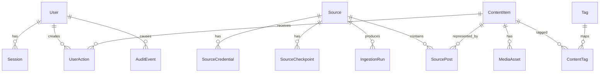

# Data Model

This document defines the intended persistent domain model. Exact Prisma field names may evolve, but the semantics, uniqueness guarantees, and relationships should remain stable unless the governing documents are updated.

## 1. Design principles

- Separate a provider occurrence from the canonical content shown in the feed.
- Preserve original attribution even when duplicates are grouped.
- Use provider IDs as opaque strings.
- Keep ingestion idempotent through database constraints.
- Use UTC timestamps.
- Bound raw payload storage.
- Avoid putting secrets in general JSON configuration.
- Record state transitions needed for operations and troubleshooting.

## 2. Core entities



## 3. Enumerations

Suggested enums:

```text
UserRole: ADMIN, MEMBER
SourceKind: RSS, LEMMY, MASTODON, REDDIT
SourceStatus: ACTIVE, PAUSED, DEGRADED, AUTH_ERROR, CONFIG_ERROR
ContentRating: SAFE, SENSITIVE, ADULT, UNKNOWN
ContentStatus: ACTIVE, REMOVED_AT_SOURCE, BROKEN, SUPPRESSED
MediaKind: IMAGE, ANIMATED_IMAGE, VIDEO, LINK
CachePolicy: NONE, FAVORITES_ONLY, TTL, ALL_WITHIN_QUOTA
CacheState: REMOTE_ONLY, QUEUED, FETCHING, CACHED, EVICTED, FAILED, BLOCKED
ActionKind: FAVORITE, HIDE, VIEW
RunTrigger: SCHEDULED, MANUAL, RETRY, BACKFILL
RunStatus: RUNNING, SUCCEEDED, PARTIAL, FAILED, CANCELLED
CredentialKind: OAUTH_CLIENT, ACCESS_TOKEN, BASIC_AUTH, CUSTOM
DuplicateReason: CANONICAL_URL, SHA256, PERCEPTUAL_HASH, MANUAL
```

## 4. Entity details

### `User`

Minimum fields:

- `id`
- `email` or username, normalized and unique
- `passwordHash`
- `role`
- `createdAt`
- `updatedAt`
- `lastLoginAt`
- `disabledAt`
- optional authentication-library fields

The MVP creates one administrator. The schema should not prevent invitation-only users later.

### `Session`

Prefer the session model required by the chosen established authentication library. Sessions must be revocable and expire.

### `AppSetting`

Stores product settings that are not deployment secrets:

- content-rating defaults
- default feed mode
- unseen behavior
- cache policy and quota
- retention windows
- source scheduling defaults

Use typed setting keys or a versioned validated JSON document. Do not scatter unvalidated arbitrary values.

### `Source`

Fields:

- `id`
- `kind`
- `displayName`
- `enabled`
- `status`
- `priority`
- `pollIntervalSeconds`
- `contentRatingPolicy`
- `minimumScore`
- `configJson` validated by connector-specific schema
- `lastAttemptAt`
- `lastSuccessAt`
- `nextPollAt`
- `consecutiveFailures`
- `lastErrorCode`
- `lastErrorSummary`
- `createdAt`
- `updatedAt`

Index enabled sources by `nextPollAt`.

### `SourceCredential`

Fields:

- `id`
- `sourceId`, nullable when credential is global
- `kind`
- `label`
- `encryptedPayload`
- `keyVersion`
- `createdAt`
- `updatedAt`

The encryption nonce/tag may be separate fields or included in a versioned envelope. Plaintext must never be returned through normal APIs.

### `SourceCheckpoint`

Fields:

- `id`
- `sourceId`
- `scope`
- `cursorJson`
- `updatedAt`

Unique on `(sourceId, scope)`. Checkpoints must be advanced transactionally after corresponding writes.

### `IngestionRun`

Fields:

- `id`
- `sourceId`
- `trigger`
- `status`
- `jobId`
- `startedAt`
- `finishedAt`
- `pagesFetched`
- `itemsSeen`
- `itemsCreated`
- `itemsUpdated`
- `duplicatesSuppressed`
- `bytesFetched`
- `attempt`
- `errorCode`
- `errorSummary`
- `rateLimitResetAt`
- `createdAt`

Index by `(sourceId, startedAt desc)`. Retain a configurable period.

### `ContentItem`

Represents the canonical feed item.

Fields:

- `id`
- `title`
- `normalizedTitle`
- `contentRating`
- `contentWarning`
- `status`
- `publishedAt`
- `firstSeenAt`
- `lastSeenAt`
- `primarySourcePostId`, nullable until relationships are created
- `canonicalUrl`, nullable
- `canonicalUrlHash`, nullable
- `rankingScore`, optional cached value
- `searchVector`, implementation-specific
- `duplicateGroupId`, nullable
- `createdAt`
- `updatedAt`

A content item may have multiple provider occurrences.

### `SourcePost`

Represents one occurrence on one provider.

Fields:

- `id`
- `sourceId`
- `contentItemId`
- `externalId`
- `originalUrl`
- `authorName`
- `communityName`
- `providerScore`
- `providerCommentCount`
- `providerCreatedAt`
- `providerUpdatedAt`
- `providerDeletedAt`
- `providerFlagsJson`
- optional bounded `rawPayloadJson`
- `createdAt`
- `updatedAt`

Required unique constraint:

```text
(sourceId, externalId)
```

Indexes should support source history, publication time, and provider score queries.

### `MediaAsset`

Fields:

- `id`
- `contentItemId`
- optional `sourcePostId`
- `kind`
- `remoteUrl`
- `previewUrl`
- `mimeType`
- `width`
- `height`
- `durationMs`
- `byteLength`
- `sha256`
- `perceptualHash`
- `position`
- `altText`
- `cacheState`
- `storageKey`
- `cachedAt`
- `cacheExpiresAt`
- `lastAccessedAt`
- `failureCode`
- `createdAt`
- `updatedAt`

Remote URLs are untrusted data. Do not expose a server-side fetch endpoint that accepts them directly.

### `UserAction`

Fields:

- `id`
- `userId`
- `contentItemId`
- `kind`
- `createdAt`
- optional `updatedAt`

Required unique constraint:

```text
(userId, contentItemId, kind)
```

A view may be represented as a single first/last-viewed record with counters if that better supports the UX. Decide in M09 and document the choice.

### `Tag`

Fields:

- `id`
- `slug`
- `displayName`
- `createdAt`

Unique normalized slug.

### `ContentTag`

Fields:

- `contentItemId`
- `tagId`
- `source` such as ADMIN, PROVIDER, RULE
- `confidence`, nullable
- `createdAt`

Unique on `(contentItemId, tagId, source)`.

### `DuplicateLink` or duplicate-group fields

The implementation may use a table when richer provenance is useful:

- `canonicalContentItemId`
- `duplicateContentItemId`
- `reason`
- `distance`, nullable
- `createdAt`

Unique per pair. Never silently discard attribution records.

### `AuditEvent`

Fields:

- `id`
- `actorUserId`
- `eventType`
- `targetType`
- `targetId`
- sanitized `metadataJson`
- `createdAt`

Audit source creation, credential changes, source deletion, policy changes, manual refresh, login failures above a threshold, and restore-sensitive actions.

## 5. Deletion behavior

- Deleting a source should stop future polling.
- Source deletion may be soft by default so historical attribution remains valid.
- The administrator may choose to purge source occurrences.
- A canonical content item with no remaining source occurrences may be removed after retention checks unless favorited or cached.
- Deleting a user must delete or anonymize that user's actions and sessions.
- Cache eviction removes bytes and updates state; it does not delete source attribution.

## 6. Indexing

At minimum, plan indexes for:

- Due enabled sources.
- Source posts by `(sourceId, providerCreatedAt)`.
- Feed items by publication time and status.
- Feed items by ranking score and publication time.
- User actions by user, kind, and creation time.
- Media cache eviction by state, expiration, and last access.
- Ingestion runs by source and start time.
- Full-text search fields.

Use `EXPLAIN ANALYZE` with representative generated data in M14 before claiming performance targets.

## 7. Migration policy

- Never edit an applied migration.
- Add nullable fields first when a backfill is required.
- Backfill in bounded batches.
- Add non-null constraints only after backfill.
- Create expensive indexes in a deployment-safe way where supported.
- Include backup and rollback notes in the pull request.
