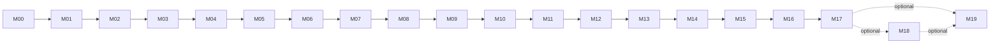

# MirthSpool Milestones

## How to read this roadmap

Milestones M00 through M17 define the v0.1 build. M18 and M19 are optional post-MVP expansions. Each milestone is intended to be completed and merged before the next begins.

| Milestone | Name | Depends on | Release stage | Outcome |
|---|---|---:|---|---|
| [M00](milestones/M00_REPOSITORY_BOOTSTRAP.md) | Repository Bootstrap | — | Foundation | Reproducible monorepo, quality tooling, and CI skeleton |
| [M01](milestones/M01_LOCAL_RUNTIME_AND_APP_SHELL.md) | Local Runtime and App Shell | M00 | Foundation | Web, worker, PostgreSQL, and Redis run in Compose |
| [M02](milestones/M02_DATABASE_AND_DOMAIN_MODEL.md) | Database and Domain Model | M01 | Foundation | Durable schema, migrations, repositories, and seed data |
| [M03](milestones/M03_AUTHENTICATION_AND_ONBOARDING.md) | Authentication and Onboarding | M02 | Foundation | Secure first-run admin and protected application |
| [M04](milestones/M04_CONNECTOR_SDK_AND_SOURCE_MANAGEMENT.md) | Connector SDK and Source Management | M03 | Ingestion | Common connector contract and source administration |
| [M05](milestones/M05_RSS_ATOM_CONNECTOR.md) | RSS/Atom Connector | M04 | Ingestion | First real source connector with fixture-driven tests |
| [M06](milestones/M06_INGESTION_SCHEDULER_AND_JOBS.md) | Ingestion Scheduler and Jobs | M05 | Ingestion | Reliable scheduled and manual source polling |
| [M07](milestones/M07_FEED_API_AND_RANKING.md) | Feed API and Ranking | M06 | Feed | Cursor-paginated new, hot, random, and unseen feeds |
| [M08](milestones/M08_WEB_FEED_EXPERIENCE.md) | Web Feed Experience | M07 | Feed | Responsive infinite feed and safe media rendering |
| [M09](milestones/M09_USER_ACTIONS_AND_LIBRARY.md) | User Actions and Library | M08 | Feed | Favorites, hides, view state, and saved views |
| [M10](milestones/M10_LEMMY_CONNECTOR.md) | Lemmy Connector | M09 | Sources | Lemmy community ingestion |
| [M11](milestones/M11_MASTODON_CONNECTOR.md) | Mastodon Connector | M10 | Sources | Hashtag and public-account media ingestion |
| [M12](milestones/M12_REDDIT_CONNECTOR.md) | Reddit Connector | M11 | Sources | OAuth-based subreddit ingestion using official APIs |
| [M13](milestones/M13_MEDIA_CACHE_AND_PROXY.md) | Media Cache and Proxy | M12 | Media | Optional bounded cache without an open proxy |
| [M14](milestones/M14_DEDUPLICATION_SEARCH_AND_FILTERS.md) | Deduplication, Search, and Filters | M13 | Discovery | Cross-source grouping, full-text search, and filters |
| [M15](milestones/M15_PWA_ACCESSIBILITY_AND_MOBILE_POLISH.md) | PWA, Accessibility, and Mobile Polish | M14 | UX | Installable and accessible phone/desktop experience |
| [M16](milestones/M16_OPERATIONS_SECURITY_AND_BACKUPS.md) | Operations, Security, and Backups | M15 | Operations | Hardened deployment, metrics, recovery, and retention |
| [M17](milestones/M17_RELEASE_AND_DOCUMENTATION.md) | Release and Documentation | M16 | Release | Reproducible v0.1 images, documentation, and upgrade path |
| [M18](milestones/M18_MULTIUSER_INVITATIONS_OPTIONAL.md) | Multi-user Invitations | M17 | Optional | Invitation-only member accounts and per-user feeds |
| [M19](milestones/M19_RECOMMENDATIONS_AND_DISCOVERY_OPTIONAL.md) | Recommendations and Discovery | M18 or M17 | Optional | Transparent local preference weighting without external AI |

## Critical path

## Milestone completion policy

A milestone is complete only when:

- Its acceptance criteria are checked.
- Required tests pass.
- Governing documentation is updated.
- New configuration is documented.
- Security and privacy impact is reviewed.
- The previous deployment can migrate forward safely.
- Codex provides the completion report required by `AGENTS.md`.
- Work stops for human review before the next milestone.

## Recommended issue mapping

Create one GitHub milestone per file and one or more implementation issues under it. Keep the Markdown file as the source of truth for scope; issues may split work but must not broaden it.
